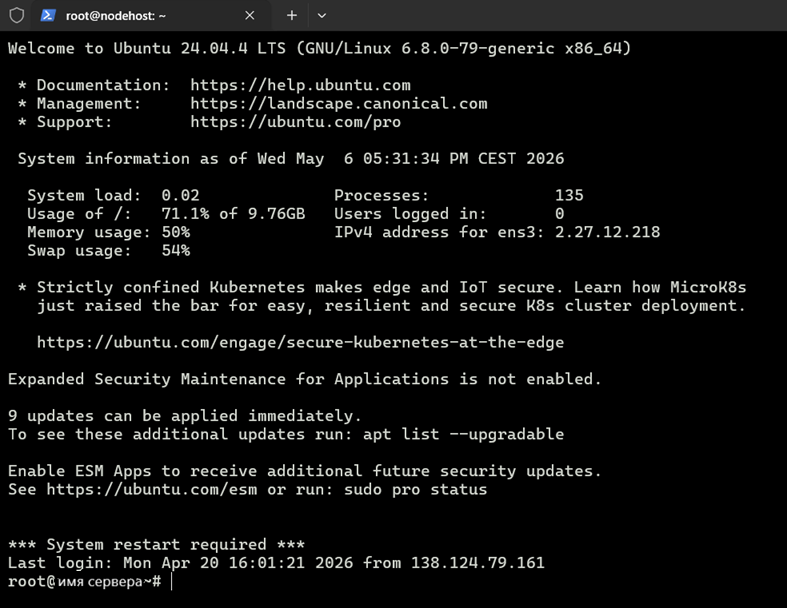
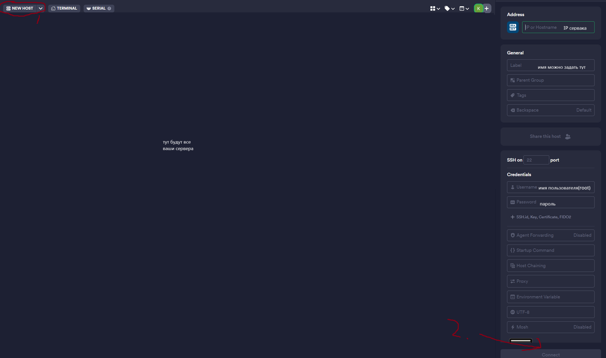
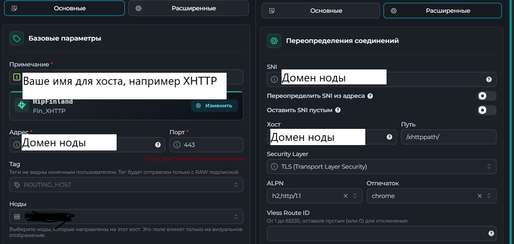
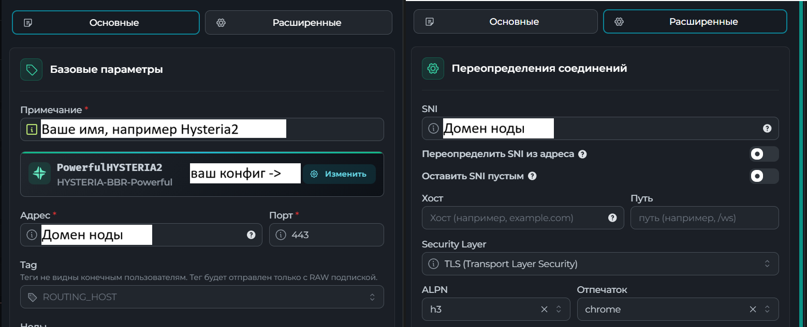
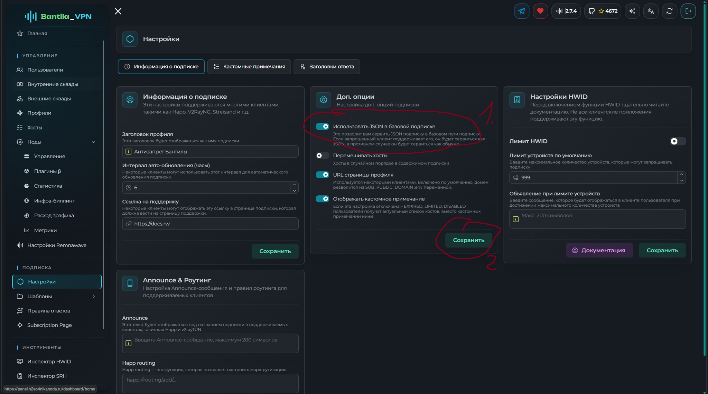

# 🛡️ Remnawave VPN — Полное руководство по установке

[](https://docs.rw)
[](https://github.com/XTLS/Xray-core)
[](https://github.com/eGamesAPI/remnawave-reverse-proxy)
[](LICENSE)

> Гайд по развёртыванию собственного VPN на базе панели **Remnawave** + **Xray** с помощью установочного скрипта от **eGamesAPI**.

---

## 📋 Содержание

1. [Подготовка](#1-подготовка)
   - [Выбор сервера](#11-выбор-сервера)
   - [Архитектура: панель и нода](#12-архитектура-панель-и-нода)
2. [Домен](#2-домен)
   - [Бесплатный домен (FreeDNS)](#21-бесплатный-домен-freedns)
   - [Платный домен + Cloudflare](#22-платный-домен--cloudflare)
3. [Установка панели](#3-установка-панели)
   - [Подключение к серверу](#31-подключение-к-серверу)
   - [Панель и нода на одном сервере](#32-панель-и-нода-на-одном-сервере)
   - [Панель и нода на разных серверах](#33-панель-и-нода-на-разных-серверах)
4. [Дополнительные транспорты](#4-дополнительные-транспорты)
   - [XHTTP](#41-xhttp)
   - [Hysteria2](#42-hysteria2)
5. [Серверный роутинг](#5-серверный-роутинг)
6. [Защита серверов](#6-защита-серверов)

---

## 1. Подготовка

### 1.1 Выбор сервера

Для развёртывания VPN понадобится VPS/VDS **за рубежом** (Нидерланды, Финляндия, Германия — хороший выбор).  
Ниже несколько хостингов, которые принимают российские карты и чьи подсети не заблокированы РКН:

| Хостинг | Локации | Комментарий |
|---|---|---|
| [Node Host](https://t.me/nodehost_bot?start=4677) | DE, SE, FI, PL, NL | Telegram-бот; есть 1G и 10G каналы. На DE — YouTube с рекламой |
| [Hip.Hosting](https://hip.hosting/?code=8038f2c25ad5281fabbb) | Много локаций | Стабильный, широкий выбор |
| [EXPRESSHOST](https://t.me/ExpressHost_Bot?start=ref_vJJK1zUM) | Базовые EU | Telegram-бот; бывают редкие отвалы |
| [LolzTeam каталог](https://lolz.live/forums/763/) | Разные | Большой список — читайте отзывы перед покупкой |

---

### 1.2 Архитектура: панель и нода

Инфраструктура Remnawave состоит из двух компонентов:

- **Панель** — центр управления нодами, конфигами и подключениями.
- **Нода** — сервер с Xray-ядром, через который идёт трафик пользователей.

Скрипт eGamesAPI умеет устанавливать **оба компонента на один сервер** — это удобно для личного использования (10–15 человек).

#### Минимальные характеристики серверов

| Конфигурация | CPU | RAM | Диск |
|---|---|---|---|
| Панель + нода (1 сервер) | 1–2 ядра | 2 ГБ | 15–20 ГБ |
| Только панель | 2 ядра | 2 ГБ | 20 ГБ |
| Только нода (до ~15 чел.) | 1 ядро | 1 ГБ | 10 ГБ |

> [!TIP]
> Если планируете больше 15 пользователей или хотите удобнее настраивать дополнительные транспорты — берите два сервера сразу.

---

## 2. Домен

### 2.1 Бесплатный домен (FreeDNS)

1. Зарегистрируйтесь на [FreeDNS](https://freedns.afraid.org/).
2. Перейдите во вкладку **Registry** / **Domain Registry**.
3. Выберите любой домен со статусом **Public** (бесплатный).
4. В меню **Add a new subdomain** создайте DNS-записи:


#### Панель и нода на **одном** сервере

| Тип | Имя | Значение | Прокси |
|---|---|---|---|
| A | `example.com` | `your_server_ip` | DNS only |
| CNAME | `panel.example.com` | `example.com` | DNS only |
| CNAME | `sub.example.com` | `example.com` | DNS only |
| CNAME | `node.example.com` | `example.com` | DNS only |

#### Панель и нода на **разных** серверах

| Тип | Имя | Значение | Прокси |
|---|---|---|---|
| A | `example.com` | `panel_server_ip` | DNS only |
| CNAME | `panel.example.com` | `example.com` | DNS only |
| CNAME | `sub.example.com` | `example.com` | DNS only |
| A | `node.example.com` | `node_server_ip` | DNS only |

> [!NOTE]
> После добавления записей подождите 10–15 минут. Проверка:
> ```bash
> ping subdomain.example.com
> ```
> Если в выводе виден IP вашего сервера — записи применились.

---

### 2.2 Платный домен + Cloudflare

Платный домен даёт своё имя и возможность использовать Cloudflare, где DNS-записи применяются мгновенно.

Купить домен можно на: [SpaceWeb](https://sweb.ru/), [LuxHOST](https://luxhost.cc/), [TimeWeb](https://timeweb.cloud/) и др.

Таблицы DNS-записей — те же, что в разделе выше.

Инструкция по переносу домена на Cloudflare: [bisquit.host/cloudflare/transfer-domain](https://wiki.bisquit.host/cloudflare/transfer-domain).

---

## 3. Установка панели

### 3.1 Подключение к серверу

Есть два способа:

**Способ 1 — через терминал ОС** (PowerShell, CMD, Terminal на Mac/Linux):

```bash
ssh root@IP_SERVER
```

- Вместо `root` подставьте имя пользователя, которое выдал хостинг (чаще всего это именно `root`).
- При **первом** подключении терминал спросит подтверждение — напечатайте `yes` и нажмите Enter.
- Затем введите пароль. **Символы пароля не отображаются** — это нормально, просто вставьте и нажмите Enter.

Если всё верно, вы увидите приветственный экран Ubuntu:



---

**Способ 2 — SSH-клиент Termius (рекомендуется)**

Termius удобнее терминала: один раз сохраняете сервер — и дальше подключаетесь двойным кликом, без ввода команд.

Скачать: [termius.com](https://termius.com/) — бесплатного тарифа хватает за глаза.

После установки:
1. Нажмите кнопку **NEW HOST** в верхнем левом углу.
2. В правой панели заполните:
   - **Address** — IP вашего сервера
   - **Label** — любое имя для удобства (например `VPN Node NL`)
   - **Username** — `root` (или что выдал хостинг)
   - **Password** — пароль от сервера
3. Нажмите **Connect** внизу правой панели.



> [!TIP]
> Все ваши серверы будут отображаться в центральной части экрана — их можно группировать и переключаться между ними в один клик.

---

### 3.2 Панель и нода на одном сервере

```bash
# 1. Если вы не root — переключитесь
sudo -i

# 2. Обновите пакеты
apt update && apt upgrade -y

# 3. Запустите скрипт eGamesAPI
bash <(curl -Ls https://raw.githubusercontent.com/eGamesAPI/remnawave-reverse-proxy/refs/heads/main/install_remnawave.sh)
```

4. Выберите язык → **1. Установка компонентов Remnawave** → **1. Установить панель и ноду на один сервер** → **1. Nginx**
5. Введите домены панели, подписки и ноды.
6. Выберите **ACME HTTP-01**, укажите email.

По завершении установки скрипт выведет:

```
=================================================
               УСТАНОВКА ЗАВЕРШЕНА!
=================================================
Панель доступна по адресу:
https://panel.example.com
-------------------------------------------------
Логин: LOGIN
Пароль: Password
-------------------------------------------------
Для повторного запуска менеджера:
remnawave_reverse
```

> [!WARNING]
> Сохраните URL панели и секретный ключ. Без них войти не получится.

Перейдите по ссылке в браузер — панель готова к работе.

---

### 3.3 Панель и нода на разных серверах

Следуйте [официальной документации Remnawave](https://docs.rw/docs/install/requirements).  
Скрипт eGamesAPI также поддерживает раздельную установку — выберите соответствующий пункт меню на шаге 4.

---

## 4. Дополнительные транспорты

### 4.1 XHTTP

XHTTP — транспорт поверх TLS/HTTPS с маскировкой под обычный веб-трафик.

#### Шаг 1 — Добавить inbound в Default профиль панели

```json
{
  "tag": "XHTTP",
  "listen": "/dev/shm/xrxh.socket,0666",
  "protocol": "vless",
  "settings": {
    "clients": [],
    "fallbacks": [],
    "decryption": "none"
  },
  "sniffing": {
    "enabled": true,
    "destOverride": ["http", "tls", "quic"]
  },
  "streamSettings": {
    "network": "xhttp",
    "xhttpSettings": {
      "mode": "auto",
      "path": "/xhttppath/",
      "extra": {
        "noSSEHeader": true,
        "xPaddingBytes": "100-1000",
        "scMaxBufferedPosts": 30,
        "scMaxEachPostBytes": 1000000,
        "scStreamUpServerSecs": "20-80"
      }
    }
  }
}
```

#### Шаг 2 — Добавить location в nginx.conf на ноде

```bash
cd /opt/remnanode && docker restart remnanode
nano /opt/remnanode/nginx.conf
```

Вставьте в конец файла:

```nginx
location /xhttppath/ {
    client_max_body_size 0;
    proxy_set_header X-Real-IP $proxy_protocol_addr;
    proxy_set_header X-Forwarded-For $proxy_protocol_addr;
    proxy_set_header Host $host;
    proxy_set_header Upgrade $http_upgrade;
    proxy_set_header Connection $connection_upgrade;
    proxy_http_version 1.1;
    client_body_timeout 5m;
    proxy_read_timeout 315s;
    proxy_send_timeout 5m;
    proxy_pass http://unix:/dev/shm/xrxh.socket;
}
```

Затем перезапустите nginx:

```bash
docker exec remnawave-nginx nginx -t && docker restart remnawave-nginx
```

#### Шаг 3 — Настроить хост в панели

В разделе **Хосты** создайте хост как на скриншоте:



В **расширенных настройках хоста** → кнопка **xHTTP** → вставьте:

```json
{
  "xmux": {
    "cMaxReuseTimes": 0,
    "maxConcurrency": "16-32",
    "maxConnections": 0,
    "hKeepAlivePeriod": 0,
    "hMaxRequestTimes": "600-900",
    "hMaxReusableSecs": "1800-3000"
  },
  "noGRPCHeader": false,
  "xPaddingBytes": "100-1000",
  "scMaxEachPostBytes": 1000000,
  "scMinPostsIntervalMs": 30,
  "scStreamUpServerSecs": "20-80"
}
```

#### Шаг 4 — Перезапустить ноду

```bash
docker restart remnanode
```

---

### 4.2 Hysteria2

> [!IMPORTANT]
> Для Hysteria2 необходим TLS-сертификат, полученный через **ACME HTTP-01** при установке панели.

#### Шаг 1 — Подключить сертификаты к контейнеру ноды

```bash
# Замените DOMAIN на ваш домен ноды (например node.example.com)
sed -i 's|      - /dev/shm:/dev/shm:rw$|      - /dev/shm:/dev/shm:rw\n      - /etc/letsencrypt/live/DOMAIN/fullchain.pem:/var/lib/remnawave/configs/xray/ssl/cert.pem:ro\n      - /etc/letsencrypt/live/DOMAIN/privkey.pem:/var/lib/remnawave/configs/xray/ssl/cert.key:ro|g' /opt/remnanode/docker-compose.yml
```

#### Шаг 2 — Создать хук автообновления сертификата

```bash
nano /etc/letsencrypt/renewal-hooks/deploy/restart-remnanode.sh
```

Вставьте в файл:

```bash
#!/bin/bash
cd /opt/remnanode && docker compose restart remnanode
```

Затем нажмите `CTRL+O` → `Enter` → `CTRL+X`.

#### Шаг 3 — Открыть порт и поднять контейнер

```bash
chmod +x /etc/letsencrypt/renewal-hooks/deploy/restart-remnanode.sh
ufw allow 443/udp
cd /opt/remnanode
docker compose down && docker compose up -d
sleep 5
docker exec -it remnanode ls -la /var/lib/remnawave/configs/xray/ssl/
```

> [!TIP]
> Все команды можно скопировать разом — они выполнятся последовательно.

Убедитесь, что в выводе последней команды видны файлы `cert.pem` и `cert.key`.

#### Шаг 4 — Создать профиль Hysteria2 в панели

Перейдите: **Профили** → нажмите **+** → задайте имя `Hysteria2` → удалите дефолтный конфиг и вставьте:

```json
{
  "log": { "loglevel": "none" },
  "inbounds": [
    {
      "tag": "HYSTERIA-BBR",
      "port": 443,
      "listen": "0.0.0.0",
      "protocol": "hysteria",
      "settings": {
        "clients": [],
        "version": 2
      },
      "streamSettings": {
        "network": "hysteria",
        "security": "tls",
        "finalmask": {
          "quicParams": {
            "debug": false,
            "congestion": "bbr"
          }
        },
        "tlsSettings": {
          "alpn": ["h3"],
          "certificates": [
            {
              "keyFile": "/var/lib/remnawave/configs/xray/ssl/cert.key",
              "certificateFile": "/var/lib/remnawave/configs/xray/ssl/cert.pem"
            }
          ]
        },
        "hysteriaSettings": {
          "version": 2
        }
      }
    }
  ],
  "outbounds": [
    { "tag": "DIRECT", "protocol": "freedom" },
    { "tag": "BLOCK", "protocol": "blackhole" }
  ],
  "routing": {
    "rules": [
      { "ip": ["geoip:private"], "outboundTag": "BLOCK" },
      { "domain": ["geosite:private"], "outboundTag": "BLOCK" },
      { "protocol": ["bittorrent"], "outboundTag": "BLOCK" }
    ]
  }
}
```

Нажмите **Сохранить**.

#### Шаг 5 — Настроить хост

Заполните хост как на скриншоте:



Присвойте профиль ноде и добавьте во внутренний сквад.  
Финальный штрих — в **Настройках** панели → вкладка **Доп. опции** → включите переключатель **«Использовать JSON в базовой подписке»** и нажмите **Сохранить**:



> [!NOTE]
> Hysteria2 работает только в клиентах **INCY** и **HAPP**.

---

## 5. Серверный роутинг

> [!NOTE]
> Видеогайд по теме: [Каскадный VPN. Серверный Роутинг Remnawave](https://youtu.be/ehHMtiT6LwA?si=Rt8FsCI92X9gvEsc)  
> Официальная документация: [docs.rw/docs/learn/server-routing](https://docs.rw/docs/learn/server-routing/)

Серверный роутинг — это когда пользователь подключается к одному серверу (например `RU-001`), а панель сама решает, куда направить его трафик дальше: российские сайты — напрямую, всё остальное — через другой сервер (`DE-001`).

> [!IMPORTANT]
> Remnawave автоматически очищает массив `clients` в серверных конфигах — это не баг. Именно поэтому нельзя просто вписать credentials напрямую в конфиг: для роутинга используется **сервисный пользователь**.

Схема которую мы настроим:

```
Пользователь → RU-001 (VLESS)
                    ├─ RU-сайты  →  DIRECT (выходит с RU-001)
                    └─ Всё остальное → DE-001 (Shadowsocks, порт 9999)
```

---

### Шаг 1 — Создать Bridge Profile для DE-001

Перейдите: **Профили** → нажмите **+** → назовите `Bridge Profile` → вставьте конфиг:

```json
{
    "log": { "loglevel": "warning" },
    "dns": {},
    "inbounds": [
        {
            "tag": "BRIDGE_DE_IN",
            "port": 9999,
            "listen": "0.0.0.0",
            "protocol": "shadowsocks",
            "settings": {
                "clients": [],
                "network": "tcp,udp"
            },
            "sniffing": {
                "enabled": true,
                "destOverride": ["http", "tls", "quic"]
            }
        }
    ],
    "outbounds": [
        { "tag": "DIRECT", "protocol": "freedom" },
        { "tag": "BLOCK", "protocol": "blackhole" }
    ],
    "routing": { "rules": [] }
}
```

Сохраните профиль.

---

### Шаг 2 — Создать Internal Squad

Перейдите в **Internal Squad** → нажмите **+** (создать новый сквад) → включите в нём только инбаунд `BRIDGE_DE_IN` из `Bridge Profile`.

Затем откройте карточку ноды `DE-001` и убедитесь, что этот инбаунд и профиль там включены.

---

### Шаг 3 — Создать сервисного пользователя

Перейдите в **Users** → создайте пользователя с именем `bridge_user_001`.

Обязательные настройки:
- **Лимит трафика** — без ограничений (0)
- **Дата истечения** — где-то в районе 2099 года
- **Сквад** — активируйте созданный выше сквад

После создания откройте карточку пользователя → **More Actions** → **Detailed Info** → прокрутите вниз и скопируйте **SS Password** (это пароль для Shadowsocks-подключения между серверами).

| Протокол инбаунда | Что копировать |
|---|---|
| Shadowsocks | SS Password |
| VLESS | VLESS UUID |
| Trojan | Trojan Password |

---

### Шаг 4 — Настроить публичный профиль на RU-001

Откройте ваш основной профиль (тот, по которому подключаются пользователи). Нас интересуют секции `outbounds` и `routing.rules`.

#### Добавить outbound на DE-001

```json
{
    "tag": "SS_OUTBOUND_TO_DE",
    "protocol": "shadowsocks",
    "settings": {
        "servers": [
            {
                "address": "IP или домен DE-001",
                "password": "ПАРОЛЬ ИЗ ШАГА 3",
                "port": 9999,
                "level": 0,
                "method": "chacha20-ietf-poly1305"
            }
        ]
    }
}
```

> [!WARNING]
> Для Shadowsocks используйте **только** метод `chacha20-ietf-poly1305` — Remnawave поддерживает исключительно его.

---

### Шаг 5 — Собрать финальный конфиг

Вот полная конфигурация публичного профиля с роутингом:

```json
{
    "log": { "loglevel": "none" },
    "inbounds": [
        {
            "tag": "PUBLIC_RU_INBOUND",
            "port": 443,
            "listen": "0.0.0.0",
            "protocol": "vless",
            "settings": { "clients": [], "decryption": "none" },
            "sniffing": { "enabled": true, "destOverride": ["http", "tls", "quic"] },
            "streamSettings": {
                "network": "raw",
                "security": "reality",
                "realitySettings": {
                    "target": "ВАШЕ ЗНАЧЕНИЕ",
                    "show": false,
                    "xver": 0,
                    "shortIds": [""],
                    "privateKey": "ВАШ ПРИВАТНЫЙ КЛЮЧ",
                    "serverNames": ["ВАШИ SERVERNAMES"]
                }
            }
        }
    ],
    "outbounds": [
        { "protocol": "freedom", "tag": "DIRECT" },
        { "protocol": "blackhole", "tag": "BLOCK" },
        {
            "tag": "SS_OUTBOUND_TO_DE",
            "protocol": "shadowsocks",
            "settings": {
                "servers": [
                    {
                        "address": "IP или домен DE-001",
                        "password": "ПАРОЛЬ ИЗ ШАГА 3",
                        "port": 9999,
                        "level": 0,
                        "method": "chacha20-ietf-poly1305"
                    }
                ]
            }
        }
    ],
    "routing": {
        "rules": [
            { "ip": ["geoip:private"], "outboundTag": "BLOCK" },
            { "domain": ["geosite:private"], "outboundTag": "BLOCK" },
            { "protocol": ["bittorrent"], "outboundTag": "BLOCK" },
            { "ip": ["geoip:ru"], "outboundTag": "DIRECT" },
            { "domain": ["geosite:category-ru"], "outboundTag": "DIRECT" },
            {
                "inboundTag": ["PUBLIC_RU_INBOUND"],
                "outboundTag": "SS_OUTBOUND_TO_DE"
            }
        ]
    }
}
```

---

### Как работают правила роутинга

Xray применяет правила **сверху вниз**, останавливаясь на первом совпадении:

| Приоритет | Условие | Действие |
|---|---|---|
| 1 | IP из `geoip:private` | BLOCK (локальные сети) |
| 2 | Домен из `geosite:private` | BLOCK |
| 3 | Трафик BitTorrent | BLOCK |
| 4 | IP из `geoip:ru` | DIRECT (выход с RU-001) |
| 5 | Домен из `geosite:category-ru` | DIRECT (выход с RU-001) |
| 6 | Всё остальное из `PUBLIC_RU_INBOUND` | Туннель на DE-001 |

> [!TIP]
> Вместо Shadowsocks в качестве транзитного протокола можно использовать и **VLESS** — структура аналогичная, отличается только секция `outbound`.

---

### Вариант: VLESS + SelfSteal Reality

Если на вашей ноде настроен **SelfSteal** (Reality со своим nginx вместо внешнего сайта) и вы хотите использовать **VLESS** как транзитный протокол вместо Shadowsocks — конфиг будет выглядеть так.

#### Отличия от базового варианта

**1. SelfSteal в `realitySettings`**

Вместо внешнего домена `dest` указывает на Unix-сокет вашего nginx. `xver: 1` включает PROXY protocol — nginx видит реальный IP клиента.

```json
"realitySettings": {
    "dest": "/dev/shm/nginx.sock",
    "show": false,
    "xver": 1,
    "spiderX": "",
    "shortIds": ["ваш_short_id"],
    "privateKey": "ваш_приватный_ключ",
    "serverNames": ["домен_ноды"]
}
```

> [!TIP]
> На сервере DE-001 откройте 9999 порт:
> ```
> ufw allow 9999/tcp
> ```

**2. VLESS outbound вместо Shadowsocks**

На Bridge Profile ноды DE-001 тоже должен быть **VLESS inbound** на порту 9999 (а не Shadowsocks).

```json
{
    "tag": "VLESS_OUTBOUND_TO_DE",
    "protocol": "vless",
    "settings": {
        "vnext": [
            {
                "address": "IP DE-001",
                "port": 9999,
                "users": [
                    {
                        "id": "UUID сервисного пользователя",
                        "level": 0,
                        "encryption": "none"
                    }
                ]
            }
        ]
    },
    "streamSettings": { "network": "tcp" }
}
```

#### Полный конфиг публичного профиля (VLESS + SelfSteal)

```json
{
    "log": { "loglevel": "none" },
    "inbounds": [
        {
            "tag": "PUBLIC_RU_INBOUND",
            "port": 443,
            "protocol": "vless",
            "settings": { "clients": [], "decryption": "none" },
            "sniffing": {
                "enabled": true,
                "destOverride": ["http", "tls", "quic"]
            },
            "streamSettings": {
                "network": "tcp",
                "security": "reality",
                "realitySettings": {
                    "dest": "/dev/shm/nginx.sock",
                    "show": false,
                    "xver": 1,
                    "spiderX": "",
                    "shortIds": ["ваш_short_id"],
                    "privateKey": "ваш_приватный_ключ",
                    "serverNames": ["домен_ноды"]
                }
            }
        }
    ],
    "outbounds": [
        { "tag": "DIRECT", "protocol": "freedom" },
        { "tag": "BLOCK", "protocol": "blackhole" },
        {
            "tag": "VLESS_OUTBOUND_TO_DE",
            "protocol": "vless",
            "settings": {
                "vnext": [
                    {
                        "address": "IP DE-001",
                        "port": 9999,
                        "users": [
                            {
                                "id": "UUID сервисного пользователя",
                                "level": 0,
                                "encryption": "none"
                            }
                        ]
                    }
                ]
            },
            "streamSettings": { "network": "tcp" }
        }
    ],
    "routing": {
        "rules": [
            {
                "ip": [
                    "10.0.0.0/8",
                    "172.16.0.0/12",
                    "192.168.0.0/16",
                    "127.0.0.0/8",
                    "100.64.0.0/10"
                ],
                "outboundTag": "BLOCK"
            },
            { "domain": ["ext:mygeosite.dat:private"], "outboundTag": "BLOCK" },
            { "protocol": ["bittorrent"], "outboundTag": "BLOCK" },
            { "ip": ["ext:myip.dat:direct"], "outboundTag": "DIRECT" },
            { "domain": ["ext:mygeosite.dat:category-ru"], "outboundTag": "DIRECT" },
            {
                "inboundTag": ["PUBLIC_RU_INBOUND"],
                "outboundTag": "VLESS_OUTBOUND_TO_DE"
            }
        ]
    }
}
```

> [!TIP]
> На сервере DE-001 откройте 9999 порт:
> ```
> ufw allow 9999/tcp
> ```


---

## 6. Защита серверов

> ⚠️ Раздел в разработке. Следите за обновлениями репозитория.

---

## 🤝 Участие в проекте

Нашли ошибку или хотите дополнить гайд? Открывайте [Issue](../../issues) или Pull Request — буду рад.

---

<div align="center">

Сделано с ❤️ для русскоязычного комьюнити  
[⬆️ Наверх](#-remnawave-vpn--полное-руководство-по-установке)

</div>
